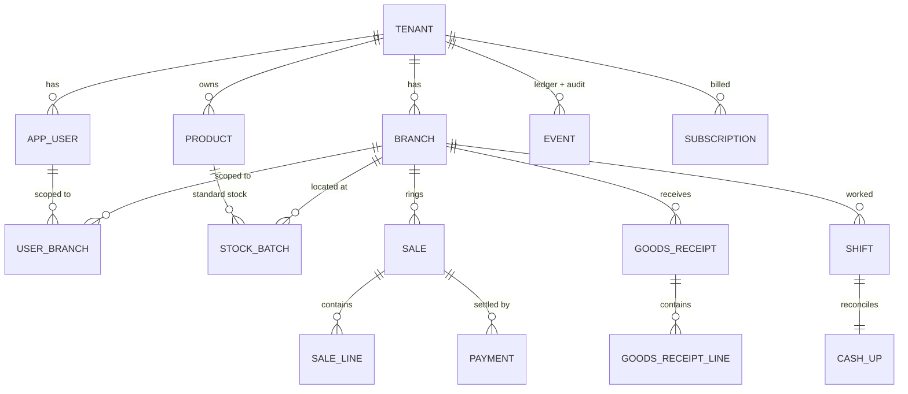

# 04 — System Design

**Project:** Pharmacy System · **Release:** V1
**Status:** ✅ Draft · owner: Bina
**Depends on:** `01-vision-and-scope.md`, `02-srs.md`, `03-architecture.md`, ADR-001–007
**Feeds:** `05-qa-and-test-strategy.md`, the walking-skeleton spike

> This is the last document before code. It makes the architecture buildable: the data
> model, the event model, the RBAC/RLS enforcement mechanism, the sync contract, and the
> core API surface. Field names and types here are the contract engineers and Claude Code
> build against.

---

## 1. Design decisions fixed in this document

| Decision | Choice | Ref |
|---|---|---|
| Primary keys | **UUIDv7**, client-generated | ADR-006 |
| Sync idempotency | `op_id` (UUIDv7), `UNIQUE(tenant_id, op_id)` | ADR-006 |
| Write ordering | monotonic `terminal_seq`, not wall-clock | ADR-006 |
| ORM / isolation | **TypeORM** + per-request `SET LOCAL` + Postgres **RLS** | ADR-007 |
| Money | integer **santim** (`bigint`), never float | §3 |
| Timestamps | **UTC** ISO-8601; Ethiopian calendar is presentation-only | §3 |
| Delta-sync cursor | server-assigned per-tenant **`change_seq`**, not `updated_at` | §7 |
| Two persistence models | relational (mutable) + event store (append-only) in one Postgres | ADR-004, §5 |

---

## 2. Conventions

- All synced tables have: `id uuid` (UUIDv7 PK), `tenant_id uuid`, `created_at timestamptz`, `updated_at timestamptz`, `deleted_at timestamptz NULL` (soft-delete), `row_version int` (optimistic concurrency), `change_seq bigint` (sync cursor, §7). Branch-scoped tables also have `branch_id uuid`.
- **No hard deletes** on domain data. Relational → `deleted_at`; event store → tombstone events.
- **No unscoped queries.** Every access goes through the request-scoped `EntityManager` (ADR-007).

---

## 3. Value conventions (correctness hygiene)

- **Money:** stored as `bigint` in **santim** (1 ETB = 100 santim). No floating point anywhere in money math. Display formats to ETB at the edge.
- **Quantities:** integers in the product's base unit; packaging conversions handled at product definition, not at transaction time.
- **Time:** persist `timestamptz` in **UTC**. The Ethiopian calendar and Amharic numerals are rendered in the presentation layer only (FR-10, BR-10.2) — no calendar logic in the domain or DB.

---

## 4. Entity–relationship overview (core)



---

## 5. Data model

### 5.1 Identity & tenancy
| Table | Key columns | Notes |
|---|---|---|
| `tenant` | `id`, `name`, `status` | `status` unrelated to subscription; see `subscription`. |
| `branch` | `id`, `tenant_id`, `name`, `address` | Tenant has ≥ 1 (BR-1.1). |
| `app_user` | `id`, `tenant_id`, `role`, `pin_hash`, `password_hash` | `role ∈ {owner, branch_manager, cashier}`. Platform Admin is a **separate** identity outside tenant scope. |
| `user_branch` | `user_id`, `branch_id` | Which branches a user is scoped to (branch managers/cashiers). Owners are all-branch by role. |

### 5.2 Catalog & pricing
| Table | Key columns | Notes |
|---|---|---|
| `product` | `id`, `tenant_id`, `name`, `unit`, `is_controlled`, `psychotropic_class` | `is_controlled=true` routes stock through the event store (§6). |
| `product_price` | `id`, `tenant_id`, `product_id`, `price_santim`, `effective_from` | Price history retained; current price = latest effective. Price changes also emit an audit event (§6). |

### 5.3 Inventory — standard drugs (mutable)
| Table | Key columns | Notes |
|---|---|---|
| `stock_batch` | `id`, `tenant_id`, `branch_id`, `product_id`, `lot_no`, `expiry_date`, `qty_on_hand` | Batch/lot granularity (BR-3.1). FEFO uses `expiry_date` (AC-3.2). `qty_on_hand` may go **negative** for standard drugs (BR-3.2). |
| `stock_adjustment` | `id`, `tenant_id`, `branch_id`, `batch_id`, `delta`, `reason` | Manual corrections; also emits an audit event. |

> Controlled substances have **no mutable stock row** — their stock is a projection (§6.3).

### 5.4 Sales & cash
| Table | Key columns | Notes |
|---|---|---|
| `sale` | `id`, `tenant_id`, `branch_id`, `shift_id`, `cashier_id`, `total_santim`, `sold_at` | Created locally, offline-first. |
| `sale_line` | `id`, `sale_id`, `product_id`, `batch_id?`, `qty`, `unit_price_santim`, `line_total_santim` | `batch_id` for standard drugs (FEFO-selected). |
| `payment` | `id`, `sale_id`, `method`, `amount_santim` | V1 `method ∈ {cash, other_recorded}`; no gateway (Vision §4). |
| `shift` | `id`, `tenant_id`, `branch_id`, `user_id`, `opened_at`, `closed_at?`, `opening_float_santim` | A staff member's till session. |
| `cash_up` | `id`, `shift_id`, `expected_santim`, `counted_santim`, `variance_santim` | Z-report; variance attributed to user+shift (BR-8.2, AC-8.1). |

### 5.5 Purchasing
| Table | Key columns | Notes |
|---|---|---|
| `goods_receipt` | `id`, `tenant_id`, `branch_id`, `supplier_name`, `received_at` | Free-form supplier in V1 (FR-7 base). |
| `goods_receipt_line` | `id`, `goods_receipt_id`, `product_id`, `lot_no`, `expiry_date`, `qty`, `cost_santim` | Standard → creates `stock_batch`; controlled → emits receipt **event**. |

### 5.6 Event store (append-only) — ADR-004
| Table | Key columns | Notes |
|---|---|---|
| `event` | `id`, `tenant_id`, `branch_id?`, `stream`, `stream_id`, `seq`, `event_type`, `payload jsonb`, `actor_id`, `terminal_id`, `occurred_at`, `op_id` | The single append-only log for **controlled-substance ledger** and **general audit**. Immutable: no update/delete. Corrections = compensating events; deletes = tombstone events. |

`stream` distinguishes purpose (e.g. `controlled_stock`, `audit`); `stream_id` groups a
substance/batch or an aggregate; `seq` orders within a stream. Retention: 7 years (NFR-5.1),
never hard-deleted.

### 5.7 Projections (read models over the event store)
| Table | Key columns | Notes |
|---|---|---|
| `controlled_stock_view` | `tenant_id`, `branch_id`, `product_id`, `qty_on_hand`, `as_of_seq` | Rebuildable from `event`. Current controlled stock (BR-3.3, AC-3.3). |

Projections are derived; if corrupted, they are **rebuilt from `event`** — the event log is
the source of truth.

### 5.8 Subscription & billing
| Table | Key columns | Notes |
|---|---|---|
| `subscription` | `id`, `tenant_id`, `state`, `current_period_end` | `state ∈ {pending, active, suspended}`. Suspended → tenant read-only (BR-1.3). |
| `payment_proof` | `id`, `tenant_id`, `screenshot_url`, `submitted_at`, `verified_by?`, `verified_at?`, `result` | Manual screenshot flow; verified by Platform Admin on the dashboard (Vision §4). Screenshot in object storage, not DB. |

### 5.9 Sync bookkeeping (server)
| Table | Key columns | Notes |
|---|---|---|
| `applied_op` | `tenant_id`, `op_id`, `applied_at` | Idempotency ledger; `UNIQUE(tenant_id, op_id)` (ADR-006). |
| `tenant_change_seq` | `tenant_id`, `value` | Monotonic counter bumped on every reference-data change; drives delta pull (§7). |

---

## 6. Event model (controlled substances + audit)

### 6.1 Event envelope
Every event is immutable and carries: `event_type`, `stream`/`stream_id`/`seq`,
`tenant_id`, `branch_id`, `actor_id`, `terminal_id`, `occurred_at` (UTC), `op_id`, and a
typed `payload`.

### 6.2 Event types (V1)
- `controlled.received` — controlled stock in (from goods receipt).
- `controlled.dispensed` — controlled dispense at POS (carries prescription reference, psychotropic class, validity check result).
- `controlled.adjusted` — compensating correction (references prior event).
- `controlled.tombstoned` — logical delete marker (never a physical delete).
- `audit.*` — who-did-what for non-controlled actions worth auditing (price change, role change, stock adjustment, subscription change).

### 6.3 Projection rule
`controlled_stock_view.qty_on_hand` = Σ(`received`) − Σ(`dispensed`) ± Σ(`adjusted`) per
`(tenant, branch, product)`, up to `as_of_seq`. Rebuildable at any time from `event`.

### 6.4 Psychotropic enforcement (FR-4) at dispense
Before writing `controlled.dispensed`, POS enforces (`[ASSUMPTION]` A-1, verify): one
psychotropic substance per prescription (**block**, not warn — BR-4.2); validity 15 days
psychotropic vs 30 days standard (reject if expired — AC-4.3); dedicated prescription paper
reference recorded. These checks run **locally** so they work offline.

---

## 7. Sync contract (ADR-005 made concrete)

### 7.1 Push — operation envelope
```
Operation {
  op_id:        uuidv7      // idempotency key, UNIQUE(tenant_id, op_id)
  terminal_id:  uuidv7
  terminal_seq: int         // monotonic per terminal → ordering (ADR-006)
  entity_type:  string      // "sale" | "goods_receipt" | "event" | "cash_up" | ...
  entity_id:    uuidv7      // client-generated target id
  op_type:      "create" | "update" | "tombstone"
  base_version: int | null  // optimistic concurrency; null on create
  tenant_id:    uuidv7
  branch_id:    uuidv7 | null
  actor_id:     uuidv7
  client_ts:    timestamptz // recorded, NOT used for ordering
  payload:      object
}
```
`POST /sync/push` accepts an ordered batch. Server applies within tenant scope (RLS),
records `applied_op`, and returns per-op acks:
```
Ack { op_id, status: "applied" | "duplicate" | "rejected", server_version?, reason? }
```
- **duplicate** → already applied; client clears it (idempotent, AC-9.2).
- **rejected** → could not apply (e.g., a business rule the client couldn't pre-validate); goes to a client "needs attention" queue. Rare in single-writer because validation runs locally first, but designed for.

### 7.2 Pull — delta by change sequence
`GET /sync/pull?cursor=<change_seq>` returns reference-data rows with `change_seq > cursor`
(products, prices, config, users/roles for the terminal's branch scope) and the new
`cursor` (max `change_seq`). The server bumps `tenant_change_seq` on every reference write;
the client stores the cursor. **Why not `updated_at`:** offline terminals have skewed
clocks and ties at equal timestamps; a server-assigned monotonic sequence is unambiguous.

### 7.3 Invariants
Local-first commit before any network (NFR-1.3); ordered per `terminal_seq`; idempotent via
`op_id`; single-writer (no conflict code, ADR-002); tombstones only; bounded staleness with
currency shown (NFR-1.2).

---

### 7.4 Contract versioning & backward compatibility
The sync envelope is a **versioned contract**, independent of the app version. Because an
offline terminal may reconnect running an older contract than the server, the server **must
serve the current and at least the previous (N-1) contract**, for a window ≥ the offline
ceiling plus margin, so a terminal offline for days never loses its queued transactions on
reconnect. Envelope changes are additive/backward-compatible by default; a breaking change
means a new contract version with dual support. Enforced as a CI gate and change-control
rule — see **ADR-009** and `06-delivery-plan.md` §6, §7.

## 8. RBAC & isolation mechanism (FR-2, ADR-003/007)

Two distinct concerns, deliberately separated:

1. **Tenant isolation (a security boundary)** — enforced by **Postgres RLS** keyed on
   `current_setting('app.current_tenant')`, set per request via `SET LOCAL` on the request
   transaction (ADR-007). This is the backstop: even a buggy query cannot cross tenants.
2. **Authorization (what a role may do)** — enforced in the **application layer** by a
   NestJS guard checking the FR-2 permission matrix (role × capability, tenant/branch
   scoped). RLS does **not** do fine-grained permissions; that's the app's job.

**Request flow:** authenticate → resolve `{tenant_id, branch_scope, role, permissions}` →
open request transaction, `SET LOCAL app.current_tenant/current_branch/current_user` →
permission guard checks the action → repositories run on the scoped `EntityManager`.

**Platform Admin** runs outside tenant scope on a least-privilege path with explicit
platform-table policies; any read of tenant data is explicit and audited (BR-2.2).

**Offline auth:** on successful online login the terminal caches a derived PIN verifier and
a snapshot of role/scope/permissions in secure storage. Offline login validates against the
cache; the session is valid within the offline window (NFR-1); privileged/admin actions may
require online re-auth after the window, but an in-progress **sale is never blocked**
(BR-2.3).

---

## 9. Core API surface (representative)

Scoped under a tenant context except the admin group. Not exhaustive — the contract, not the catalog.

| Group | Endpoints (representative) |
|---|---|
| Auth | `POST /auth/login`, `POST /auth/refresh` |
| Tenant/Branch | `POST /branches`, `GET /branches`, `POST /users`, `POST /users/:id/branches` |
| Catalog | `POST /products`, `PATCH /products/:id`, `POST /products/:id/price` |
| Inventory | `GET /stock?product=`, `POST /stock/adjust` |
| POS | `POST /sales` *(offline-first; normally arrives via sync)*, `GET /sales/:id` |
| Purchasing | `POST /goods-receipts` |
| Controlled | `POST /controlled/dispense`, `GET /controlled/ledger?from=&to=`, `GET /controlled/stock` |
| Reporting | `GET /reports/cash-up?shift=`, `GET /reports/sales-summary`, `GET /reports/expiry` |
| **Sync** | `POST /sync/push`, `GET /sync/pull?cursor=` |
| Admin (above tenant) | `POST /admin/tenants`, `POST /admin/payment-proofs/:id/verify`, `POST /admin/subscriptions/:id/(suspend\|activate)` |

Core-loop writes (sales, receipts, dispenses, cash-up) normally reach the server **through
`/sync/push`**, not direct calls — the direct POSTs exist for the dashboard and tests.

---

## 10. Concurrency, consistency & failure handling

- **Idempotency:** `UNIQUE(tenant_id, op_id)` + `applied_op` ledger; replays are no-ops.
- **Optimistic concurrency:** `row_version` checked on update-type ops; mismatch → `rejected` ack (should not occur in single-writer, but guards against bugs).
- **Oversell:** allowed for standard drugs (BR-3.2); each oversell increments an observable counter (NFR-7) and is surfaced for physical reconciliation. It is **detected and reported, never silently swallowed** (ADR-002).
- **Partial sync failure:** push is a batch of independent ops with per-op acks; a mid-batch network drop is safe because unacked ops remain in the outbox and are retried idempotently.
- **Projection integrity:** `controlled_stock_view` is rebuildable from `event`; the event log, not the projection, is the source of truth.

---

## 11. Migrations & seed
Single shared schema → **one** TypeORM migration path for all tenants (the payoff of
ADR-003). RLS policies are created in migrations alongside tables. Seed data: role
definitions and the permission matrix (FR-2). No hard-coded tenants.

---

## 12. Traceability (design → requirements)

| Requirement | Design element |
|---|---|
| FR-1 tenant/branch | §5.1, §9 |
| FR-2 RBAC + isolation | §8, §5.1 |
| FR-3 inventory (standard, FEFO, negative stock) | §5.3, §10 |
| FR-4 POS + psychotropic rules | §5.4, §6.4 |
| FR-6 controlled ledger + audit | §5.6, §6 |
| FR-7 goods receipt | §5.5 |
| FR-8 reporting + cash-up | §5.4, §9 |
| FR-9 single-writer sync | §7, §10 |
| FR-10 localization | §3 |
| NFR-1 offline window | §7, §8 (offline auth) |
| NFR-3 perf (<100ms local) | §7 (local-first), §2 |
| NFR-4 security/isolation | §8, ADR-007 |
| NFR-5 retention | §5.6, §5.8 |

---

## 13. What the walking skeleton builds from this doc
The thin slice (Vision §8, Architecture §9) implements the **minimum real** pieces:
`tenant`/`branch`/`app_user` (§5.1) · one `product` + `stock_batch` (§5.2–5.3) · `sale` +
`sale_line` (§5.4) · the `SyncService` push/pull (§7) · RLS + scope guard (§8) · a dashboard
read of the synced sale. No controlled ledger, no reporting beyond a raw read. If this
slice is green under a simulated offline period, the spine is proven and breadth can begin.
