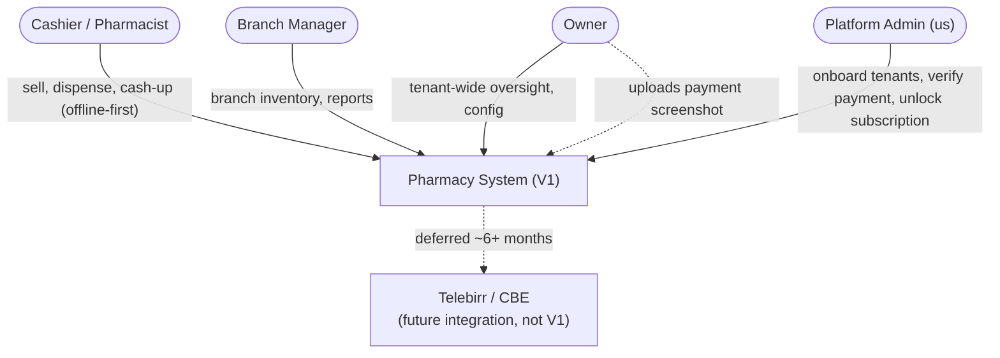
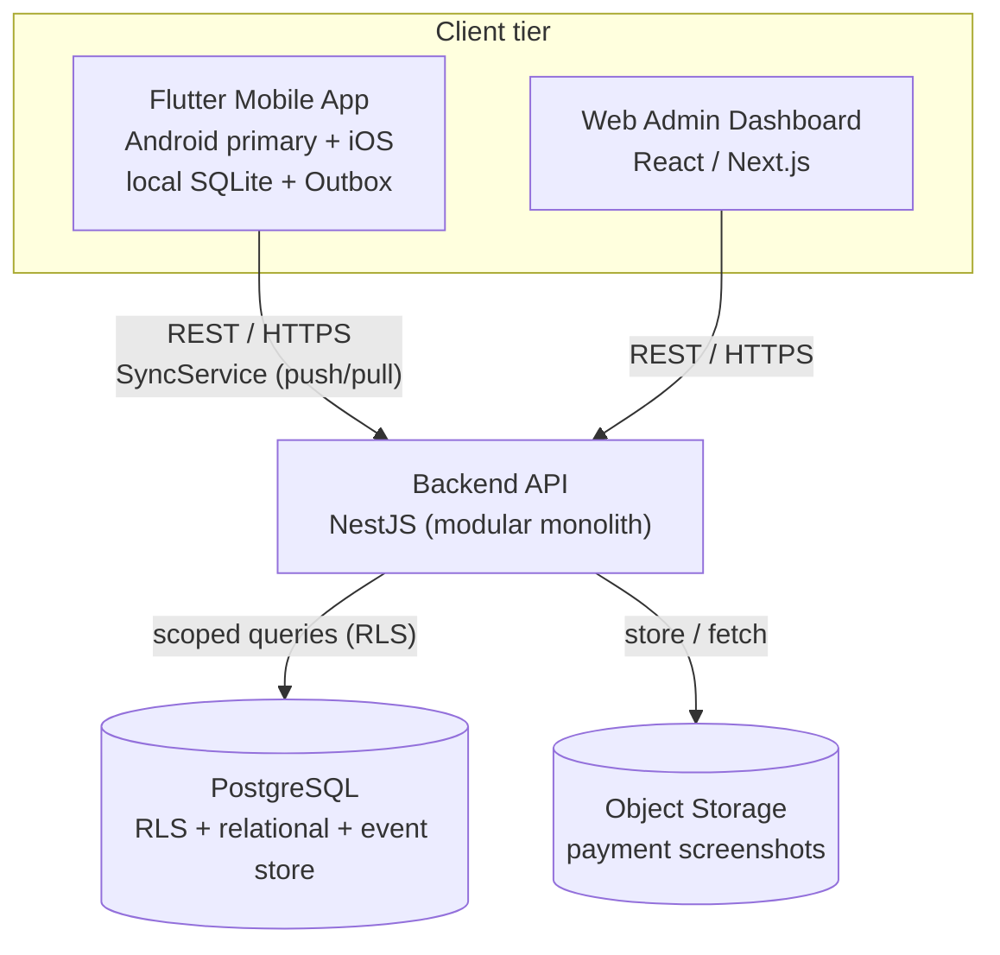
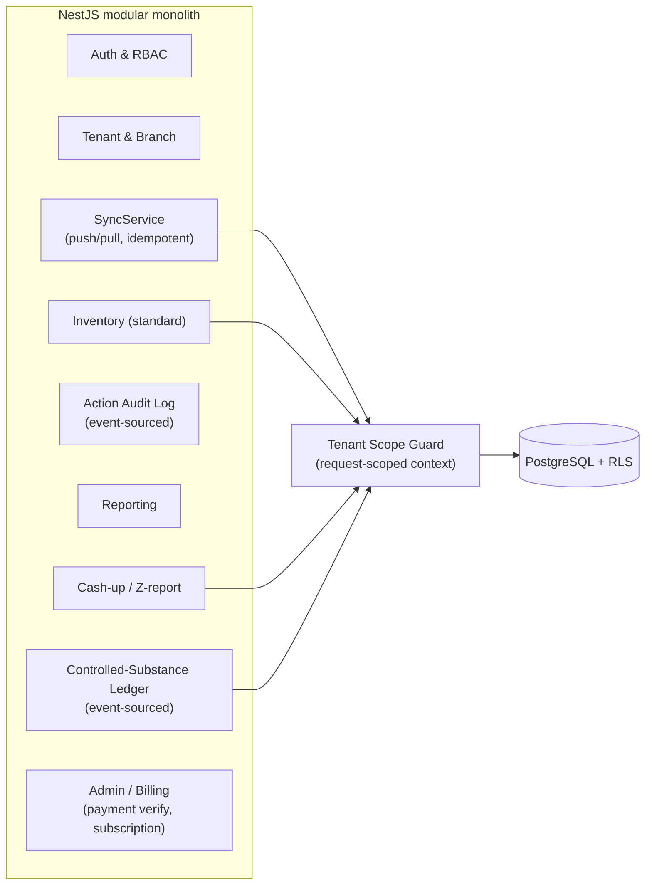
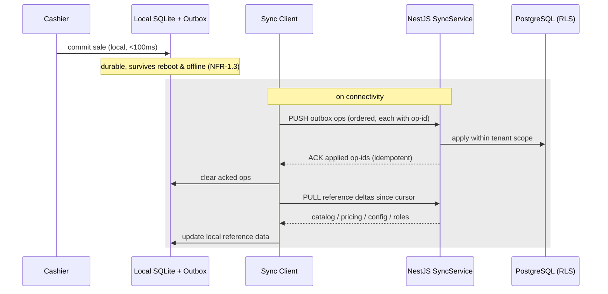
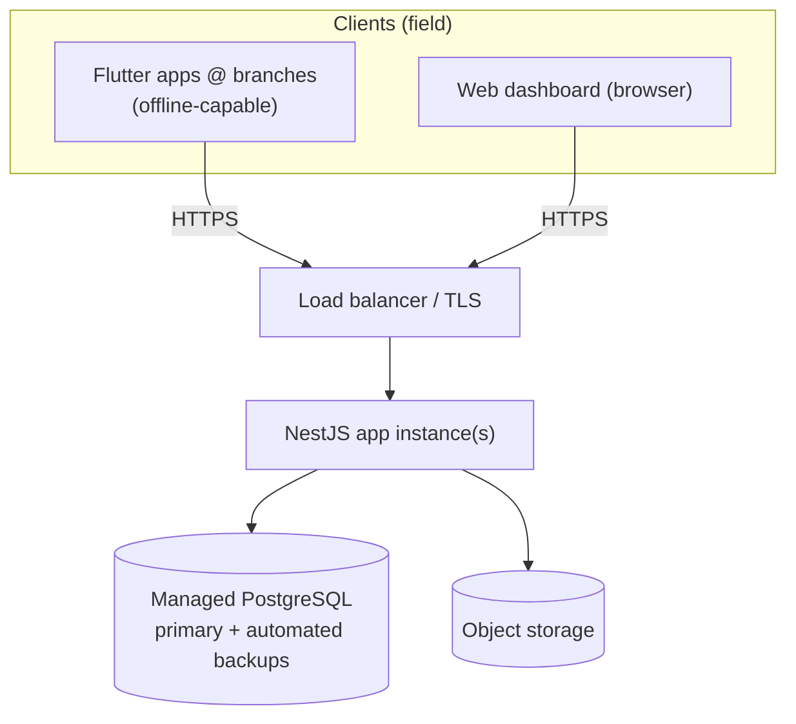

# 03 — Architecture

**Project:** Pharmacy System · **Release:** V1
**Status:** ✅ Draft · owner: Bina
**Depends on:** `01-vision-and-scope.md`, `02-srs.md`, ADR-001–005
**Feeds:** `04-system-design.md`, `05-qa-and-test-strategy.md`

> This document describes the **structure**: how the system is decomposed into containers
> and components, how requests and sync flow, how tenants are isolated, and how it deploys.
> The *detailed* data model, API contract, and sync envelope live in `04-system-design.md`.

---

## 1. Architectural drivers

The forces that actually shape this architecture (everything else is downstream):

1. **Offline-first, conservation-law core loop** — the counter must sell through power cuts; writes go local-first (NFR-1, ADR-002). This is the dominant driver.
2. **Multi-tenant isolation at 1,000 tenants** in a regulated domain — a code bug must not leak across tenants (ADR-003).
3. **Regulated, immutable controlled-substance records** coexisting with ordinary mutable inventory (ADR-004). Two data models, one system.
4. **Single-writer now, multi-writer later** — the sync layer must be simple in V1 but swappable in V2 (ADR-002, ADR-005).
5. **Multi-engineer team + Claude Code** — clear, conventional module boundaries matter more than cleverness.

---

## 2. C4 Level 1 — System context

**Boundary note:** V1 has **no live external integrations**. Payment is a manual
screenshot flow verified by the Platform Admin. This is deliberate (Vision §4) and keeps
the V1 attack/failure surface small.

---

## 3. C4 Level 2 — Containers

| Container | Tech | Responsibility |
|---|---|---|
| **Mobile app** | Flutter (Dart) | The core loop, offline-first. Owns local SQLite, the outbox, and the client half of `SyncService`. Android is the primary build/test target (ADR-001). |
| **Web admin dashboard** | React/Next.js | Platform operations: tenant onboarding, **payment-screenshot verification**, subscription unlock/suspend. Runs *above* tenant scope. Also serves owner back-office oversight (covers the deferred desktop app, ADR-001). |
| **Backend API** | NestJS | One API for all clients. A **modular monolith** in V1 (see §4). Owns RLS-scoped access, the ledger, and the server half of `SyncService`. |
| **PostgreSQL** | Postgres | Single shared DB. Holds relational state (mutable inventory, sales) **and** the append-only event store (controlled ledger, audit log). RLS enforces tenant isolation. |
| **Object storage** | S3-compatible | Payment screenshots and (later) report exports. Kept out of the relational DB. |

### Why a modular monolith, not microservices (V1)
At 1,000 tenants with a small-to-medium team and an offline-first client absorbing load,
microservices would add distributed-systems tax (network hops, partial failure, deploy
complexity) for no capability we need. A **modular monolith** with strict internal module
boundaries gives us clean seams to split later *if* scale demands it, without paying the
tax now. This mirrors the single-writer/multi-writer sequencing philosophy: don't buy
complexity before the problem arrives.

---

## 4. C4 Level 3 — Backend components (NestJS modules)

| Module | Maps to | Notes |
|---|---|---|
| Auth & RBAC | FR-2 | Resolves tenant/branch scope + permission matrix; issues tokens; supports offline cached auth. |
| Tenant & Branch | FR-1 | Tenant/branch lifecycle; enforces "≥1 branch". |
| Inventory (standard) | FR-3 | Mutable stock, batch/lot, expiry, negative-stock policy, FEFO. |
| ~~POS / Dispensing~~ | FR-4 | **No such module, and there should not be one.** See the note below. |
| Controlled-Substance Ledger | FR-6 | Append-only events; projections for current stock; compensating events only. |
| Action Audit Log | FR-6 (generalized) | Who-did-what across the system; same event infra as the ledger. |
| ~~Purchasing / Goods Receipt~~ | FR-7 (base) | **No such module.** A receipt reaches the server as a sync operation, exactly like a sale; `SyncService.applyGoodsReceipt` hands off to Inventory. |
| Reporting | FR-8 | Daily sales, sales summary, stock/expiry, oversells. |
| Cash-up | FR-8 | Its own module rather than part of Reporting: a cash-up **writes** — it closes the shift and records the variance — and putting a write path inside a read module is how read modules acquire writes. |
| **SyncService** | FR-9 | The seam (ADR-005). Ordered, idempotent push; delta pull. Concrete protocol hidden behind the interface. |
| Admin / Billing | FR-1, payment flow | Screenshot verification, subscription state (pending/active/suspended). Runs above tenant scope. |

> **Why there is no POS module (corrected 2026-09-24).** This table originally listed
> "POS / Dispensing — sale assembly, pricing", describing a server that assembles sales. It
> never did, and ADR-002 is the reason: the terminal assembles the sale **offline**, against
> its own SQLite, and the server's whole job is to apply the operation that arrives later.
> A server-side POS module would be a second place where a sale is constructed — and two
> constructions of the same thing is precisely the drift `05-qa` §6 calls catastrophic.
>
> FR-4's server half is therefore `SyncService.applySale` plus Inventory, and FR-7's is
> `applyGoodsReceipt`. The decomposition below now says so. The psychotropic rules that row
> also claimed are Phase 2 and gated on A-1 (ADR-015) — they exist nowhere, by design.

**Cross-cutting: the Tenant Scope Guard.** A request-scoped context carries `tenant_id`
(and `branch_id`); it (a) sets the Postgres session variable RLS keys on, and (b) is
asserted by every repository. Two layers, one bug away from a leak is still safe (ADR-003).

### Mobile app components (client)
`UI` → `Domain Repositories` → `Local DB (SQLite)` + `Outbox`; a `Sync Client`
(`SyncService` client half) drains the outbox and applies pulled deltas. The UI reads and
writes **only** local state; the network is never on the critical path of a sale (NFR-3.2).

---

## 5. The sync path (the crux of the system)

Invariants (from ADR-002/005, SRS FR-9):
- **Local-first:** every core-loop write is committed and durable locally before any network attempt.
- **Ordered + idempotent:** ops carry client-generated IDs; replay is a no-op (AC-9.2).
- **Single-writer (V1):** no conflicts possible → no conflict-resolution code exists yet.
- **Tombstones only:** deletes never physically remove rows (ledger/audit/soft-delete).
- **Staleness bounded:** reference data may lag up to the offline window; the client shows currency (NFR-1.2).

---

## 6. Data architecture — two models, one database

The system deliberately runs **two persistence models side by side** in one Postgres:

| Model | Used by | Shape | Delete |
|---|---|---|---|
| **Mutable relational** | standard inventory, sales, tenants, products, pricing | normal tables, updated in place | soft-delete |
| **Append-only event store** | controlled-substance ledger, action audit log | immutable events; current state is a **projection** | tombstone events only |

This split is the architectural expression of ADR-004: event-source *only* the regulated
subset (audit-defensible), keep the ordinary 95% simple (no needless event-sourcing).
Projections give fast "current stock" reads over the ledger without a mutable counter.

---

## 7. Deployment topology (V1)

- **Single region** for V1 (users are in Ethiopia); revisit for latency/DR later.
- **Managed Postgres** with automated backups sized to the **retention window** (NFR-5): backups must independently guarantee the 7-year ledger horizon — a tenant leaving must not purge legally-retained data within the window.
- **Modest server footprint** is acceptable *because* offline-first pushes availability responsibility to the client; the backend targets **99.5%** (NFR-1.4), not 99.9%.
- Web dashboard served as static assets + the same NestJS API.

---

## 8. Cross-cutting concerns

- **Security:** TLS everywhere; hashed credentials; on-device secure storage for cached auth; **RLS as the isolation backstop** beneath app-layer scoping (NFR-4, ADR-003).
- **Observability:** sync telemetry (outbox depth, sync failures/retries), **oversell counters** (from the negative-stock policy), and ledger-write metrics surfaced to the platform team (NFR-7).
- **Localization:** Amharic/English + Ethiopian-calendar rendering is a **presentation-layer** concern; storage stays UTC ISO-8601 (FR-10, BR-10.2). No calendar logic leaks into the domain or DB.
- **Migrations:** single shared schema → **one migration path** for all tenants (the payoff of ADR-003 over schema-/DB-per-tenant).

---

## 9. Walking-skeleton mapping

The first spike (Vision §8) exercises a thin slice through the real architecture — not a
prototype to throw away:

`Flutter (local SQLite + outbox)` → `Sync Client` → `NestJS SyncService` → `Tenant Scope
Guard (+RLS)` → `PostgreSQL` → back to the `Web Admin Dashboard`, for **one tenant, one
branch, one terminal**: receive stock → sell a standard drug → decrement → sync → visible
on the dashboard. If this slice is green, the spine every other module bolts onto is
proven. It touches: Auth (minimal), Tenant/Branch, Inventory (standard), POS, SyncService,
Reporting (minimal), Admin dashboard.

---

## 10. Deferred / non-goal boundaries (so nothing leaks into V1)
- Multi-writer conflict engine (ADR-002) — the `SyncService` seam is the only accommodation; **no conflict code in V1**.
- Inter-branch transfer (FR-5) — **online-only**, V1.x; not in the offline sync path.
- Microservice split — not until scale demands it; module boundaries preserve the option.
- Payment-gateway integration — future external system; V1 boundary ends at the manual screenshot flow.
