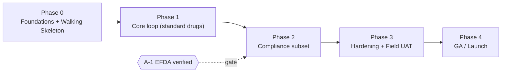
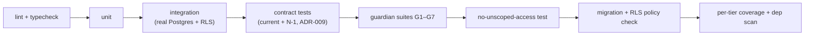
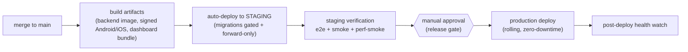

# 06 — Delivery Plan

**Project:** Pharmacy System · **Release:** V1
**Status:** ✅ Draft · owner: Bina
**Depends on:** all of `01`–`05`, ADR-001–009
**Feeds:** execution — repos, CI/CD, sprints

> How this gets built and shipped: the SDLC model, the risk-first phasing, the CI/CD
> pipelines, the environments and their parity, the branching/release workflow, and the
> change control that the regulated subset requires. This document is meant to be
> unambiguous enough that engineers and Claude Code can execute against it directly.

---

## 1. SDLC model — resolving "strict SDLC"

The instinct from day one was "strict SDLC + perfect documentation." That instinct is
**half-right and half-dangerous**, and this is the resolution:

- **Half-right:** a regulated (controlled-substance), data-critical system genuinely needs requirement traceability, controlled change to its load-bearing contracts, documented decisions, and audit artifacts. We keep all of that — it is exactly what `01`–`05` and the ADRs provide.
- **Half-dangerous:** strict **waterfall** would commit the entire design and build before validating the system's dominant technical risk — the offline sync spine on conservation-law inventory (ADR-002). In an uncertain market, with a sync problem new to the team, that bets the whole build on unvalidated assumptions.

**The model:** **iterative, incremental, risk-first delivery** — spike the spine before
breadth — **wrapped in controlled change for the regulated/load-bearing subset** (sync
contract, event ledger, RLS policies, compliance rules). Move fast on ordinary features;
move deliberately, with sign-off, on the parts that lose money or break compliance. The
documentation is the requirements rigor waterfall wanted, kept **living**, not frozen.

---

## 2. Phasing (risk-first sequencing)

| Phase | Scope | Exit gate |
|---|---|---|
| **P0 Foundations + Walking Skeleton** | Repos, CI/CD, environments (incl. staging) stood up; the thin vertical slice (`03`§9): one tenant/branch/terminal, receive→sell→decrement→sync→dashboard. | Skeleton passes guardian **G1, G2, G4, G7**; CI/CD auto-promotes to staging; staging reachable. |
| **P1 Core loop** | FR-1, FR-2, FR-3 (standard, FEFO, negative-stock), FR-4 (standard sale), FR-7 (base receipt), FR-8 (+ cash-up), FR-9 (single-writer), FR-10. | All guardian suites full; core e2e journeys green; perf within NFR-3 on staging. |
| **P2 Compliance subset** | FR-6 (ledger), FR-4 (psychotropic rules), general audit log. **Entry gate: A-1 verified.** | Compliance tests **final** (not provisional); RTM complete for regulated reqs; sign-off. |
| **P3 Hardening + Field UAT** | Performance + security passes, low-end Android device matrix, pilot in a real pharmacy through real outages. | Pilot sign-off; launch-readiness checklist (§11) green. |
| **P4 GA** | Staged production rollout. | Post-deploy health within thresholds. |

**Post-V1:** V1.x — FR-5 inter-branch transfer (**online-only**), FR-8a advanced reporting,
desktop (Flutter Windows). **V2** — multi-writer offline + conflict engine (full FR-9 +
NFR-2), FR-7a/b ordering. **Parallel track** — Telebirr/CBE integration.

---

## 3. Iteration cadence

- **2-week sprints.** Sprint 0 = Phase 0 foundations. Lean ceremonies (planning, review, retro); no ceremony for its own sake.
- **Backlog items carry a FR/NFR id and an RTM row.** No item is "ready" without acceptance criteria (from the SRS) and a traceability link.
- **Definition of Ready:** requirement id + acceptance criteria + RTM entry + dependencies known (incl. whether it touches a controlled artifact, §7).
- **Definition of Done:** per `05-qa` §13 — standard vs. regulated. Regulated items are never done on green tests alone until A-1 is verified.

---

## 4. Branching & git workflow

**Trunk-based development with short-lived feature branches and PRs.** Rationale: a small-to-mid
team shipping frequently is better served by short-lived branches merged to a protected
`main` than by long-lived release branches that accumulate merge conflict and drift. Releases
are cut from `main` by **tag**, not by a parallel branch.

**Branch protection on `main` (non-negotiable):**
- No direct pushes; all changes via PR.
- Required status checks: **all CI gates** (§6) green — guardian suites, contract tests (incl. N-1, ADR-009), no-unscoped-access, migration check, per-tier coverage, dependency scan.
- ≥ 1 review; **2 reviews for controlled-artifact changes** (§7), one of whom owns compliance for ledger/psychotropic changes.
- Linear history; squash merge.

> **Amended by [ADR-011](adr/ADR-011-solo-maintainer-change-control.md) while the project has
> a single maintainer.** The review counts above are unsatisfiable alone — GitHub does not
> permit approving your own PR — so they are replaced by mechanical gates plus a recorded
> self-review, and merge commits are allowed for curated multi-commit PRs. Everything else in
> this section stands unchanged. **The rules above return the moment a second engineer
> joins**; ADR-011 exists to be superseded.

---

## 5. Environments

| Env | Purpose | Parity & data |
|---|---|---|
| **Local** | Dev inner loop | Real Postgres (container) so RLS runs; synthetic seed. |
| **CI** | Automated verification per PR | Ephemeral, real Postgres service container; multi-tenant seed harness (`05-qa` §11). No real data. |
| **Staging** | Production-like validation, e2e, perf | **Fly.io (single region) + Neon managed Postgres 16**, dashboard on GitHub Pages. Same Postgres major + RLS policies + non-owner application role as prod; auto-deployed on merge and smoke-tested live. Representative multi-tenant seed and the **low-end Android device lab** are Phase 1. **No real patient/controlled-substance data — synthetic only.** See `engineering/staging.md`. |
| **Production** | Live | Single region (Ethiopia users); managed Postgres with automated backups sized to the **7-year** retention window (NFR-5); monitoring/SLO. |

**Config & secrets:** environment config is externalized; secrets live in a managed secret
store, never in the repo or images; each environment has its own. Staging and production
must not share credentials or data.

---

## 6. CI/CD pipelines (sharp)

Three build targets — backend (NestJS), mobile (Flutter), web dashboard — each with a CI
stage (on PR) and a CD stage (on merge to `main`).

### 6.1 CI — runs on every PR (must pass to merge)

Any red stage blocks the merge (ADR-008). Contract tests validate the sync envelope on both
client and server **and** the previous contract version (ADR-009).

### 6.2 CD — promotion path on merge to `main`

- **DB migrations** run as a **gated, forward-only** step (RLS policies included), tested on staging with production-like data before prod. A migration that isn't safe to run against live data doesn't ship.
- **Backend deploy:** rolling / zero-downtime; **N-1 sync contract must stay served** throughout (ADR-009). Rollback = redeploy previous image; migrations are forward-only, so schema changes are designed to be backward-compatible with the previous app version (expand-then-contract).
- **Mobile deploy:** signed **Android** (primary) to an internal test track → staged production rollout on the store; **iOS** from the same codebase to TestFlight → App Store (account **iOS review lead time** in the schedule — it is not same-day). Clients update out-of-band; the server never assumes a client has updated (ADR-009).
- **Dashboard:** static bundle + the shared API.

### 6.3 Release health & rollback triggers
Post-deploy, watch the guardian-relevant signals (sync failure/retry rate, oversell counts,
error rate, p95 latency). Threshold breach → automatic alert and rollback decision. A
suspected S1 (data loss / cross-tenant / ledger) is an immediate rollback + incident.

---

## 7. Change control (the "strict" part that's warranted)

Most changes flow through the normal PR path. **Controlled artifacts** carry stricter
process because breaking them is an S1:

**Controlled artifacts:** the sync envelope (`04`§7), the event/ledger schema (`04`§5.6),
RLS policies (ADR-007), and compliance rules (FR-4/FR-6).

**Required for any change to a controlled artifact:**
1. A new or updated **ADR**.
2. **Contract-test** update (and, for the sync envelope, N-1 compatibility verification, ADR-009).
3. **Guardian-suite** update covering the change.
4. **Two reviews**, one from the compliance owner for ledger/psychotropic changes.
   → *While single-maintainer (ADR-011): the `controlled-artifact` CI job enforces 1, 3 and a
   recorded self-review, and fails the build without them. Compliance sign-off moves to a
   dated entry in `compliance-sign-off.md` — an approval click by the author would attest to
   nothing, and the dated record is what an auditor actually asks for.*
5. RTM updated.

This is where traceability lives. It is deliberately heavier than ordinary feature work and
deliberately lighter than applying waterfall ceremony to everything.

---

## 8. Roles & responsibilities (V1)

| Role | Owns |
|---|---|
| Tech lead | Architecture integrity, ADRs, controlled-change sign-off |
| Backend | NestJS API, sync server half, RLS, ledger |
| Mobile | Flutter clients, local DB + outbox, sync client half |
| QA | Guardian suites, contract/property/perf tests, RTM upkeep |
| Compliance owner | **A-1 verification**, ledger/psychotropic sign-off |
| Platform ops | Environments, CI/CD, backups, monitoring, tenant onboarding + payment verification |

---

## 9. Risk register (delivery)

| Risk | Mitigation | Owner |
|---|---|---|
| **A-1 unverified** (EFDA retention/rules) | Gate on Phase 2; provisional compliance tests until verified | Compliance owner |
| Sync contract drift / breaking offline clients | Single-source schema + generated types; N-1 compat gate (ADR-009) | Backend + QA |
| Offline guarantee unprovable in CI | Low-end device matrix + field UAT pilot as release gate | QA |
| Unsafe migration against live data | Forward-only, expand-then-contract, staging dry-run with prod-like data | Backend + Ops |
| iOS review latency delaying release | Schedule buffer; server never assumes client version (ADR-009) | Mobile |

Full product-level risks/assumptions: Vision & Scope §7.

---

## 10. Versioning
- **Apps** (mobile, dashboard, backend) use **SemVer**, released by git tag with a changelog.
- **Sync contract** is versioned **independently** with an N-1 support window ≥ offline ceiling + margin (ADR-009).

---

## 11. Launch-readiness checklist (V1 GA gate)

Go/no-go — **all** required:
- [ ] All guardian suites (G1–G7) green on `main`.
- [ ] Contract tests green, incl. **N-1** compatibility (ADR-009).
- [ ] Performance within NFR-3 budgets on staging (incl. low-end Android).
- [ ] Security pass: cross-tenant isolation, full authz matrix, dependency scan.
- [ ] **A-1 verified**; compliance tests final (not provisional); RTM complete for regulated reqs.
- [ ] Backups verified by a **restore drill**; 7-year retention configured.
- [ ] Rollback tested (redeploy previous image; migration backward-compat confirmed).
- [ ] **Field UAT pilot** signed off (real pharmacy, real outages).
- [ ] Runbook + monitoring/alerting live; on-call for launch defined.

---

## 12. Documentation completeness (this suite)
`01` Vision & Scope · `02` SRS · `03` Architecture · `04` System Design · `05` QA & Test
Strategy · `06` Delivery Plan, plus ADR-001–009, all cross-referenced and traceable. The
design track is complete; the next action is **Phase 0**: stand up CI/CD + environments and
build the walking skeleton to its guardian gate.
